# Recreate Eudaimonia Reservation System (HTML/CSS/PHP/JS)

Recreate the v0/Next.js restaurant reservation system as a traditional web app using HTML, CSS, PHP, and JavaScript. Built phase-by-phase for 3 team members.

## User Review Required

> [!IMPORTANT]
> **No database in initial phases.** All data will be hardcoded/mock until a backend is introduced. PHP is used for templating (includes/partials) and page routing, not yet for business logic.

> [!IMPORTANT]
> **Aesthetic direction:** The original uses a refined, luxury fine-dining aesthetic with burgundy/cream tones, Playfair Display (serif) + a clean sans-serif. Per the frontend-design skill, we'll commit to a bold **"luxury editorial"** aesthetic — warm deep tones, generous whitespace, serif-forward typography, subtle motion on scroll/hover. No generic AI look.

> [!WARNING]
> **No Tailwind CSS.** All styling is vanilla CSS with CSS custom properties mirroring the original design tokens. CSS files are modular (one per page/component).

---

## Source Code Analysis Summary

The original app has **24 pages** across 3 areas:

| Area | Pages |
|------|-------|
| **Public** | Home, About, Dining Zones (index + 3 detail), Book (multi-step wizard), Confirmation, Login, Register |
| **Guest Dashboard** | Overview, Book Reservation, My Reservations, History, Profile |
| **Admin Panel** | Dashboard, Reservations (tabbed + dialogs), Floor Management, Users, Reports |

**Key design tokens** (from `globals.css`):
- Primary: deep burgundy `oklch(0.35 0.12 20)`
- Background: warm cream `oklch(0.97 0.01 85)`
- Accent: gold/amber `oklch(0.75 0.12 75)`
- Sidebar: dark charcoal `oklch(0.18 0.02 30)`
- Fonts: Playfair Display (serif), Inter (sans-serif)

---

## Proposed Changes

### Phase 1: Foundation & Project Structure

Creates the skeleton and design system. Everything else depends on this.

#### [NEW] Project Directory Structure
```
project-root/
├── index.php                  (home page)
├── css/
│   ├── variables.css          (design tokens: colors, fonts, spacing)
│   ├── reset.css              (modern CSS reset)
│   ├── typography.css         (font imports, heading/body styles)
│   ├── base.css               (global layout, utilities, container)
│   ├── components.css         (buttons, cards, badges, forms, inputs)
│   ├── nav.css                (navigation bar + mobile menu)
│   ├── footer.css             (footer styles)
│   ├── home.css               (home page specific)
│   ├── about.css              (about page)
│   ├── dining-zones.css       (dining zones pages)
│   ├── auth.css               (login & register shared)
│   ├── book.css               (booking flow)
│   ├── dashboard.css          (guest dashboard layout + pages)
│   └── admin.css              (admin panel layout + pages)
├── js/
│   ├── nav.js                 (mobile menu toggle, scroll behavior)
│   ├── book.js                (multi-step booking form)
│   ├── dashboard.js           (dashboard sidebar, interactions)
│   └── admin.js               (admin panel interactions)
├── php/                       (business logic - future phases)
├── includes/
│   ├── header.php             (DOCTYPE, <head>, meta, CSS links)
│   ├── nav.php                (navigation bar partial)
│   ├── footer.php             (footer partial)
│   └── admin-sidebar.php      (admin sidebar partial)
│   └── dashboard-sidebar.php  (user dashboard sidebar partial)
├── pages/
│   ├── about.php
│   ├── login.php
│   ├── register.php
│   ├── book.php
│   ├── book-confirmation.php
│   ├── dining-zones/
│   │   ├── index.php
│   │   ├── patio.php
│   │   ├── dining-room.php
│   │   └── bar.php
│   ├── dashboard/
│   │   ├── index.php
│   │   ├── book.php
│   │   ├── reservations.php
│   │   ├── history.php
│   │   └── profile.php
│   └── admin/
│       ├── index.php
│       ├── reservations.php
│       ├── floor.php
│       ├── users.php
│       └── reports.php
└── assets/
    └── images/                (placeholder images)
```

#### [NEW] [variables.css](file:///c:/Users/ANDREI/Documents/Web%20Development/Restaurant%20Online%20Booking%20System/css/variables.css)
CSS custom properties matching the original design tokens (colors, radii, spacing, fonts).

#### [NEW] [reset.css](file:///c:/Users/ANDREI/Documents/Web%20Development/Restaurant%20Online%20Booking%20System/css/reset.css)
Modern box-sizing reset, margin/padding normalization.

#### [NEW] [typography.css](file:///c:/Users/ANDREI/Documents/Web%20Development/Restaurant%20Online%20Booking%20System/css/typography.css)
Google Fonts imports (Playfair Display, DM Sans), heading hierarchy, body text.

#### [NEW] [base.css](file:///c:/Users/ANDREI/Documents/Web%20Development/Restaurant%20Online%20Booking%20System/css/base.css)
Container, section spacing, flex/grid utilities, responsive breakpoints.

#### [NEW] [components.css](file:///c:/Users/ANDREI/Documents/Web%20Development/Restaurant%20Online%20Booking%20System/css/components.css)
Reusable UI: buttons (`.btn`, `.btn-primary`, `.btn-outline`, `.btn-ghost`), cards, badges, form inputs, labels, select, dialogs/modals, tabs, progress indicators.

#### [NEW] [nav.css](file:///c:/Users/ANDREI/Documents/Web%20Development/Restaurant%20Online%20Booking%20System/css/nav.css)
Fixed header with backdrop blur, desktop nav links, mobile hamburger menu styles.

#### [NEW] [footer.css](file:///c:/Users/ANDREI/Documents/Web%20Development/Restaurant%20Online%20Booking%20System/css/footer.css)
Dark footer with 4-column grid layout.

#### [NEW] [header.php](file:///c:/Users/ANDREI/Documents/Web%20Development/Restaurant%20Online%20Booking%20System/includes/header.php)
Common `<head>` with meta tags, favicon, CSS includes. Accepts `$pageTitle` and `$pageCSS` variables.

#### [NEW] [nav.php](file:///c:/Users/ANDREI/Documents/Web%20Development/Restaurant%20Online%20Booking%20System/includes/nav.php)
Navigation bar with active-link highlighting via PHP `$currentPage` variable.

#### [NEW] [footer.php](file:///c:/Users/ANDREI/Documents/Web%20Development/Restaurant%20Online%20Booking%20System/includes/footer.php)
Footer partial with links, contact info, hours.

#### [NEW] [nav.js](file:///c:/Users/ANDREI/Documents/Web%20Development/Restaurant%20Online%20Booking%20System/js/nav.js)
Mobile menu toggle, header scroll-based opacity, smooth transitions.

---

### Phase 2: Public Pages

Static content pages using the includes and design system.

#### [NEW] [index.php](file:///c:/Users/ANDREI/Documents/Web%20Development/Restaurant%20Online%20Booking%20System/index.php) + [home.css](file:///c:/Users/ANDREI/Documents/Web%20Development/Restaurant%20Online%20Booking%20System/css/home.css)
- Full-screen hero with background image, gradient overlay, CTA buttons
- Philosophy section
- Dining Zones cards (3-column grid with hover zoom)
- Features section (4-column icon grid)
- CTA banner (burgundy background)

#### [NEW] [about.php](file:///c:/Users/ANDREI/Documents/Web%20Development/Restaurant%20Online%20Booking%20System/pages/about.php) + [about.css](file:///c:/Users/ANDREI/Documents/Web%20Development/Restaurant%20Online%20Booking%20System/css/about.css)
- Page hero, story section (2-col with image), values cards, team grid, CTA

#### [NEW] Dining Zones pages + [dining-zones.css](file:///c:/Users/ANDREI/Documents/Web%20Development/Restaurant%20Online%20Booking%20System/css/dining-zones.css)
- Index: hero + alternating image/text rows + private events CTA
- Patio/Dining-Room/Bar detail pages: hero image, overview + details sidebar, table listings, CTA

---

### Phase 3: Auth Pages

#### [NEW] [login.php](file:///c:/Users/ANDREI/Documents/Web%20Development/Restaurant%20Online%20Booking%20System/pages/login.php) + [auth.css](file:///c:/Users/ANDREI/Documents/Web%20Development/Restaurant%20Online%20Booking%20System/css/auth.css)
- Centered card with email/password, show/hide password toggle, admin portal link

#### [NEW] [register.php](file:///c:/Users/ANDREI/Documents/Web%20Development/Restaurant%20Online%20Booking%20System/pages/register.php)
- Registration form with name, email, phone, password, confirm, terms checkbox

---

### Phase 4: Booking Flow

#### [NEW] [book.php](file:///c:/Users/ANDREI/Documents/Web%20Development/Restaurant%20Online%20Booking%20System/pages/book.php) + [book.css](file:///c:/Users/ANDREI/Documents/Web%20Development/Restaurant%20Online%20Booking%20System/css/book.css) + [book.js](file:///c:/Users/ANDREI/Documents/Web%20Development/Restaurant%20Online%20Booking%20System/js/book.js)
- 4-step wizard: Guest Info → Zone Selection → Date & Time → Confirmation
- Progress indicator, step navigation, form validation
- JS handles step transitions, zone card selection, date picker (native `<input type="date">`), time slot grid

#### [NEW] [book-confirmation.php](file:///c:/Users/ANDREI/Documents/Web%20Development/Restaurant%20Online%20Booking%20System/pages/book-confirmation.php)
- Success state with mock reservation details, link to register/home

---

### Phase 5: Guest Dashboard

#### [NEW] Dashboard pages + [dashboard.css](file:///c:/Users/ANDREI/Documents/Web%20Development/Restaurant%20Online%20Booking%20System/css/dashboard.css) + [dashboard.js](file:///c:/Users/ANDREI/Documents/Web%20Development/Restaurant%20Online%20Booking%20System/js/dashboard.js)
- **Layout**: fixed sidebar (desktop) / hamburger (mobile), main content area
- **Overview**: stats cards, upcoming reservations list, quick actions
- **Book**: single-page form with zone cards, date/time, summary sidebar
- **Reservations**: tabbed view (pending/confirmed/cancelled) + cancel modal
- **History**: past visits with star ratings
- **Profile**: personal info, dining preferences, notification toggles, security

---

### Phase 6: Admin Panel

#### [NEW] Admin pages + [admin.css](file:///c:/Users/ANDREI/Documents/Web%20Development/Restaurant%20Online%20Booking%20System/css/admin.css) + [admin.js](file:///c:/Users/ANDREI/Documents/Web%20Development/Restaurant%20Online%20Booking%20System/js/admin.js)
- **Layout**: dark sidebar with admin badge, nav links, user info
- **Dashboard**: stat cards, recent reservations with approve/reject, zone occupancy bars, quick actions
- **Reservations**: search/filter, tabbed view, detail modal, approve/reject dialogs
- **Floor Management**: zone tabs, table grid (color-coded status), edit/add table modals
- **Users**: searchable data table, user profile modal with stats
- **Reports**: summary stats, daily bar chart, peak hours chart, monthly trends, zone breakdown

---

## Team Work Division (Parallel Workflow)

> [!TIP]
> **Phase 1 is done together** (we build it here first). After that, all 3 members work **simultaneously** on separate areas with no blocking dependencies.

```mermaid
gantt
    title Development Timeline
    dateFormat  X
    axisFormat %s
    section Shared
    Phase 1 - Foundation :done, p1, 0, 1
    Phase 7 - Polish      :p7, 4, 5
    section Member A
    Public Pages (Home, About, Dining Zones) :a1, 1, 3
    section Member B
    Auth + Booking Flow :b1, 1, 3
    section Member C
    Guest Dashboard + Admin Panel :c1, 1, 4
```



| Member | Works On (in parallel) | Files Owned |
|--------|----------------------|-------------|
| **A** | Public pages: Home, About, Dining Zones (index + 3 detail) | `index.php`, `pages/about.php`, `pages/dining-zones/*`, `css/home.css`, `css/about.css`, `css/dining-zones.css` |
| **B** | Auth pages + Booking flow | `pages/login.php`, `pages/register.php`, `pages/book.php`, `pages/book-confirmation.php`, `css/auth.css`, `css/book.css`, `js/book.js` |
| **C** | Guest Dashboard + Admin Panel | `pages/dashboard/*`, `pages/admin/*`, `css/dashboard.css`, `css/admin.css`, `js/dashboard.js`, `js/admin.js`, `includes/admin-sidebar.php`, `includes/dashboard-sidebar.php` |

**Shared files** (Phase 1, built first — everyone uses these): `css/variables.css`, `css/reset.css`, `css/typography.css`, `css/base.css`, `css/components.css`, `css/nav.css`, `css/footer.css`, `includes/header.php`, `includes/nav.php`, `includes/footer.php`, `js/nav.js`

Each member pushes their work independently. No one blocks anyone else.

---

## Verification Plan

### Manual Verification (per phase)
1. **Open each page in browser** (via PHP local server: `php -S localhost:8000`)
2. **Check responsive design** at 3 breakpoints: mobile (375px), tablet (768px), desktop (1280px)
3. **Verify navigation** — all links work, active states highlight correctly
4. **Check interactive elements** — mobile menu toggle, booking wizard steps, modals open/close, tabs switch
5. **Compare visually** to the original Next.js design for layout and color fidelity

### Automated Security Scan
- Run Snyk code scan on PHP and JS files after each phase
- Fix any identified security issues before pushing

### Browser Testing
- Use the browser subagent tool to open each page and visually verify rendering
